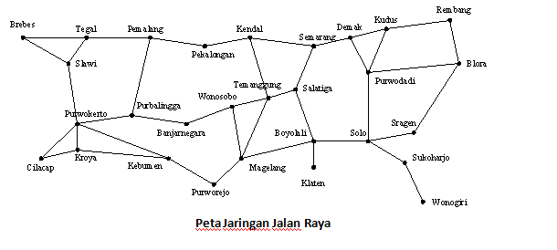
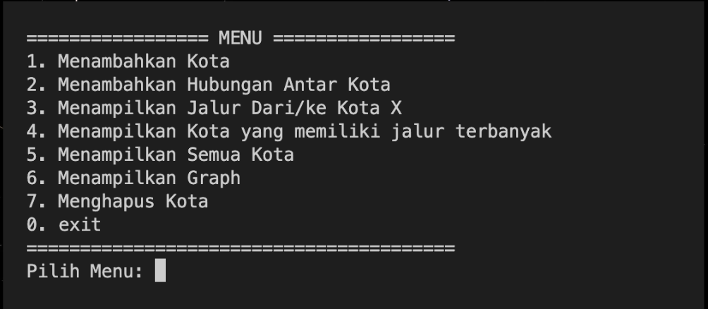

# Tubes STD Graph Map

>run code bisa di coba di sini [HERE](https://onlinegdb.com/0AEXtkkKK)

# Apa itu Struktur Data ?
>Struktur data adalah cara menyimpan dan mengatur data secara terstruktur pada sistem komputer atau database sehingga lebih mudah diakses. Secara teknis, data dalam bentuk angka, huruf, simbol, dan lainnya ini diletakkan dalam kolom-kolom dan susunan tertentu. 
>
>Contoh : Array, Linked List, Stack, Queue, Tree, Graph, Hash Table

# Apa itu Linked List ?
>Linked list adalah strukur data linier berbentuk rantai simpul di mana setiap simpul menyimpan 2 item, yaitu nilai data dan pointer ke simpul elemen berikutnya. Berbeda dengan array, elemen linked list tidak ditempatkan dalam alamat memori yang berdekatan melainkan elemen ditautkan menggunakan pointer.

# Apa itu Graph ?
>Graph adalah jenis struktur data umum yang susunan datanya tidak berdekatan satu sama lain (non-linier). Graph terdiri dari kumpulan simpul berhingga untuk menyimpan data dan antara dua buah simpul terdapat hubungan saling keterkaitan.

# Pendahuluan Program
>Dengan topik yang kami pilih yaitu Multi Linked List Graph 1 ke N, kami memutuskan untuk membuat Program "Jalur Kota", yang menunjukkan berapa banyak hubungan dalam 1 kota tersebut.

